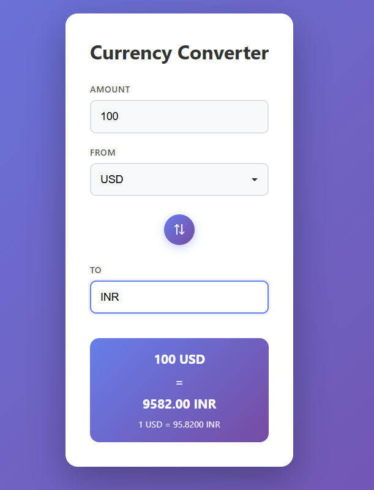

# Currency Converter

A modern, responsive currency converter built with React.


## Screenshots

### UI



## Features

- Real-time currency conversion using live exchange rates
- Support for multiple currencies
- Swap currencies with a single click
- Clean and intuitive user interface
- Responsive design for mobile and desktop
- Live exchange rate display

## Getting Started

### Prerequisites

- Node.js (version 14 or higher)
- npm or yarn


### Installation

1. Install dependencies:
```bash
npm install
```

2. Start the development server:
```bash
npm start
```

3. Open [http://localhost:3000](http://localhost:3000) to view it in your browser.

## Available Scripts

- `npm start` - Runs the app in development mode
- `npm build` - Builds the app for production
- `npm test` - Launches the test runner
- `npm eject` - Ejects from Create React App (one-way operation)

## API

This app uses the [ExchangeRate-API](https://www.exchangerate-api.com/) for fetching live currency exchange rates.

## Technologies Used

- React 18
- JavaScript (ES6+)
- CSS3
- ExchangeRate-API

## License

This project is open source and available under the MIT License.
